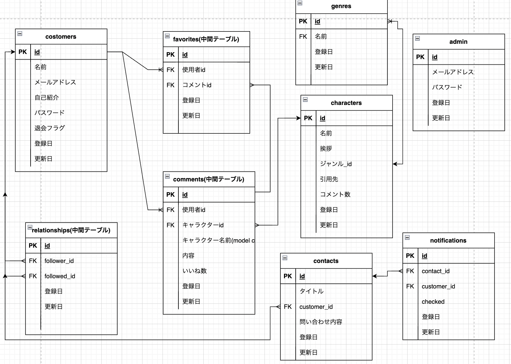

# 推しVコメ

## サイト概要

### サイトテーマ
推し活動を推しの詳細ページでコメントをして発信するコミュニティサイトです。

### テーマを選んだ理由
近年応援したい人に対して行う活動を推し活が普及し、度々テレビやSNSなどで取り上げられたりされています。しかし、取り上げられていると言っても
単体で取り上げらています。また、推し活と言っても推しているキャラクターによって大幅に違うことがあったりと調べる時も一苦労します。
なので、一つのサイトで少しでも多く情報を得られるために、このテーマを選びました。

### ターゲットユーザ
* どのように推し活をしていきば良いのかを理解したい人。
* 推し活について人前で話ことが苦手だが伝えたい人のため。
* 自分の推し活に磨きを極めたい人のため。

### 主な利用シーン
* 推し活をしたいがどの様にしたら良いのかを知りたい時。
* 推し活を共有したり、人におすすめしたいことを発言したい時

## 開発環境
- OS：Linux(CentOS)
- 言語：HTML,CSS,JavaScript,Ruby,SQL
- フレームワーク：Ruby on Rails
- JSライブラリ：jQuery
- IDE：Cloud9
## ER図

## 機能一覧
### 基本機能
- 各種CRUD処理
- ログイン機能/ゲストログイン機能
- - 退会機能
- フォロー/フォロワー機能
- コメント機能
- いいね機能
- 検索機能
- ランキング機能
- 問い合わせ機能
- 通知機能

### UI/UX
- レシポンシブ対応

### 開発効率向上
- bootstrap

## 使用素材
- また、管理人でもVtuberのスクリーンショットなどを使用しないで下さい。そうしない場合は内容が良くてもNGとなります。
Vtuber本人が宣伝してほしいと願っている場合でも無許可で画像を使用すると違法になり訴訟リスクがあり、
ゲーム実況や著作権がある歌などの画像を使用するなども、Vtuberだけではなく各著作権所持者に訴訟されるリスクとなります。
- ですので、外部サービスの画像素材を使用した場合は、必ず管理人は引用先、使用者の場合は自己紹介にサービス名とURLを明記してください。

## その他
もし、推しているキャラクターがいない場合は、キャラクター詳細ページにその他のキャラとして作り、
そこでキャラクターの名前とコメントを一緒に記せる様にします。